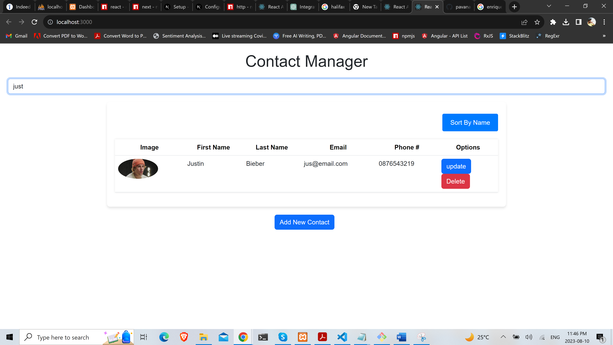

## **Contact Manager App**

### **Overview**

The Contact Manager App is a full-stack application that allows users to manage a list of contacts, where each contact has details such as their name, email, phone, and profile image. The backend server connects to a MySQL database to perform CRUD operations (Create, Read, Update, Delete), while the frontend allows users to interact with their contacts through a well-defined user interface.

### **Backend (Node.js & MySQL)**

#### **Key Dependencies:**
- `express`: Web server framework
- `cors`: Middleware to enable cross-origin requests
- `body-parser`: Middleware to parse incoming request bodies
- `multer`: Middleware to handle `multipart/form-data`, primarily used for file uploads
- `mysql`: Node.js driver for MySQL

#### **Functionalities:**
1. **MySQL Connection:** The app connects to a MySQL database named `contactDB` using root user.
2. **API Endpoints:**
    - **POST `/api/contacts`**: Add a new contact.
    - **GET `/api/contacts`**: Fetch all contacts.
    - **GET `/api/contacts/:id`**: Fetch a contact by ID.
    - **PUT `/api/contacts/:id`**: Update a contact by ID.
    - **DELETE `/api/contacts/:id`**: Delete a contact by ID.
    - **POST `/api/contacts/upload`**: Endpoint for uploading contact images.

#### **File Storage:**
- Profile images of contacts are stored in the `uploads` directory on the server.
  
### **Frontend (React.js)**

#### **Components Overview:**

1. **ContactData:**
    - Responsible for adding or updating contact data.
    - Uses the `ContactController` for CRUD operations.
    - Contains an integrated form to collect contact details, including an image upload functionality.
    - Implements validation for the first name, last name, email, and phone number.

2. **ContactRow:**
    - Represents each row of contact data in the table.
    - Displays the contact's image, first name, last name, email, phone number, and options (update or delete).

3. **ContactTable:**
    - Contains headers for the contact table.
    - Populates the table with data coming from the `ContactRow` component.
    - Provides a button to sort contacts by name.

4. **UpdateOrDelete**:
    - Offers the functionality to either update a contact's details or delete a contact.

5. **SortByLastName**:
    - The "Sort by Last Name" feature allows users to order the contact list in ascending or descending order based on the last name (`lName`). The `handleSortByName` function is responsible for this functionality. When called, it checks the current ordering state (stored in the `isAscending` state variable) and sorts the contact list accordingly. After sorting, it updates the contact list and toggles the `isAscending` state to invert the order for the next sort action.

6. **Search Operation**:
    - The app also includes a search feature, allowing users to filter contacts by entering a keyword. This functionality is handled by the `searchContact` function.
    - The search input field captures user input in real-time and triggers the `searchContact` function on change. When the input length reaches or surpasses 3 characters, the function filters the contacts based on the entered keyword. If the keyword exists in any part of the contact's details (e.g., first name, last name, email, etc.), that contact is shown. If the input is reduced below 3 characters, the function restores the full contact list from the `cacheSearch` state variable.

### **How to Run**

#### **Backend:**
1. Navigate to the project directory.
2. Run `npm install` to install the necessary dependencies.
3. Ensure your MySQL server is running and the `contactDB` database is set up.
4. Run the server using `node server.js` or `npm start`. The server will start on port 5000.

#### **Frontend:**
1. Navigate to the frontend directory (assuming it's separated).
2. Run `npm install` to install the necessary dependencies.
3. Run `npm start` to start the React development server, by default it will run on `http://localhost:3000`.

### **Future Enhancements & Recommendations**
- Adding authentication to protect data and ensure only authorized users can modify the contact list.
- Implementing pagination for handling a large number of contacts.
- Considering using an ORM (Object Relational Mapping) tool like Sequelize for safer and more efficient database operations.

### Some Output Screens

